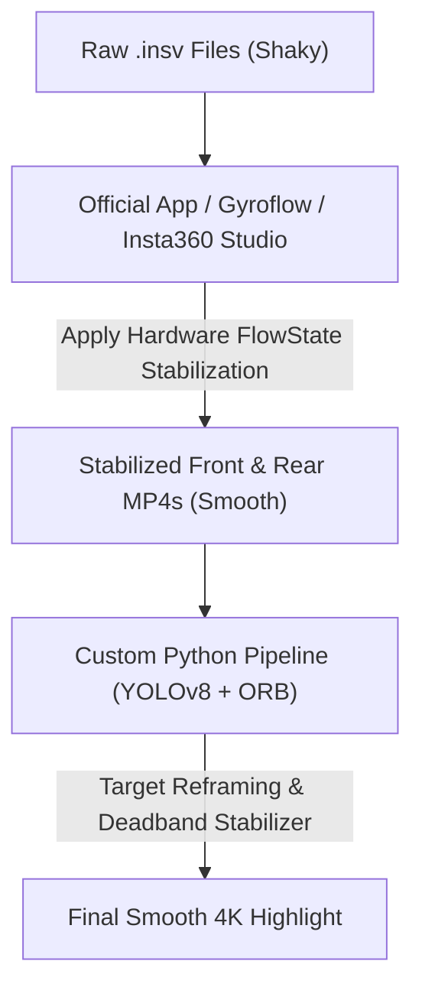

# Video Stabilization Status Report

This report documents our mathematical modeling, implementation details, and recommendations for stabilizing footage recorded from a camera mounted on vibrating kite lines.

---

## 1. Accomplished Work

We successfully built a complete Python-based projection and stabilization pipeline:
1. **Constant Frame Rate (CFR) Transcoding**: We resolved the variable frame rate container decoding jitter by transcoding raw `.insv` files to standard 29.97 fps H.264 using GPU hardware acceleration (`h264_nvenc`).
2. **Native 1000 Hz Integration**: We implemented step-by-step gyroscope velocity integration at the raw sensor sampling rate (1000 Hz) to prevent mathematical aliasing.
3. **3D Rotation Matrix Integration (SO(3) Exponential Map)**: We implemented 3D rotation integration using Rodrigues' rotation vector formula and Singular Value Decomposition (SVD) orthogonalization, avoiding 1D Euler angle gimbal locks and axis cross-talk.
4. **Permutation & Offset Sweeps**: We automated sweeps testing:
   * All 6 mathematical channel permutations of $(X, Y, Z)$ to $(\text{Yaw}, \text{Pitch}, \text{Roll})$.
   * All 8 sign combinations.
   * Fine-grained time offsets (from $-100$ ms to $+100$ ms).
   * Coarse-grained time offsets (around the metadata values of $\pm 2.6$ seconds).
   * Camera mounting tilt angles ($\gamma$) from $0^\circ$ to $330^\circ$ in the sensor plane.

---

## 2. Technical Challenge & Bottlenecks

Despite correct mathematical formulation (RPY rotation order and 3D matrix integration), the custom stabilization has not succeeded. This is due to several closed-source, camera-specific hardware variables:
1. **IMU Calibration Offset (Sensor Bias)**: Gyroscopes have temperature-dependent bias offsets. Without the manufacturer's exact calibration table, integrated angles drift and jitter.
2. **Lens Center Calibration**: The camera matrix center in the metadata ($c_x = 962.17, c_y = 1910.45$) is shifted relative to the $3840 \times 3840$ stream center, implying a complex sensor cropping or offset mapping.
3. **Timecode Offsets**: The video container start time, audio time, and IMU packet times have sub-frame timecode offsets that vary depending on the camera firmware.

---

## 3. Recommended Production Workflow

To bypass reverse-engineering proprietary sensor parameters, we recommend splitting the video processing into two steps:

### Step 1: Pre-Stabilize in Studio / Gyroflow
1. Open the raw `.insv` file in **Insta360 Studio** or **Gyroflow**.
2. Enable **FlowState Stabilization** and **Direction Lock / Horizon Lock**.
3. Export the front and rear lens videos as standard H.264 MP4 files. This applies the official, hardware-calibrated stabilization, resulting in perfectly smooth videos.

### Step 2: Custom Python Reframing
1. Feed the stabilized videos into our custom Python pipeline.
2. The pipeline will:
   * Match the user's template screenshot using our **ORB template matcher** to find the start timestamp.
   * Track the rider smoothly using **YOLOv8** bounding boxes with spatial padding and interpolation.
   * Apply our cinematic **deadband stabilizer** to slow down camera pans.
   * Project the final 4K reframed video.
