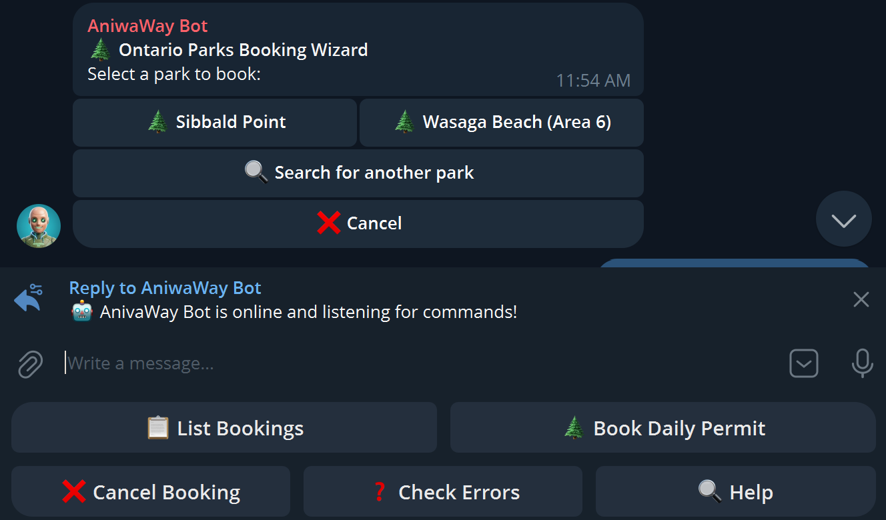
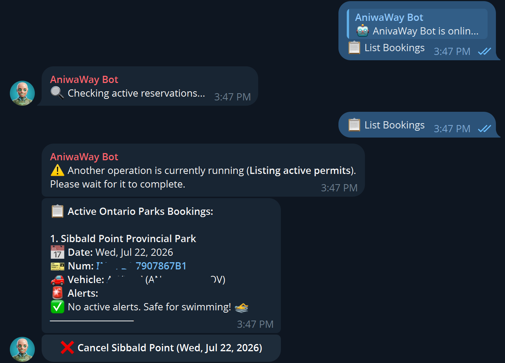
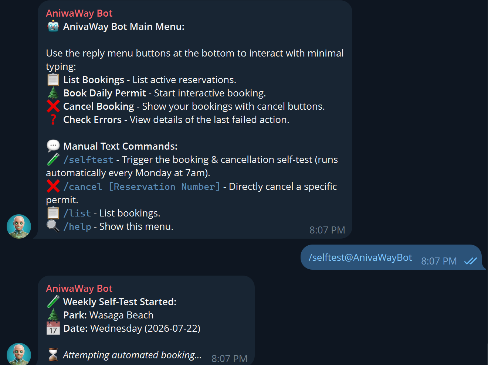
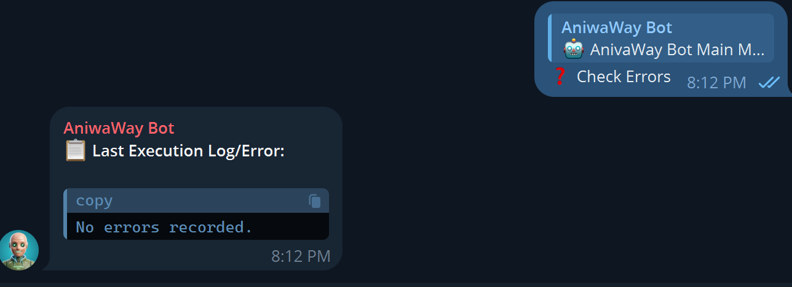

# Ontario Parks Booking Bot & Automation

A Python tool and Telegram Bot to automate searches, wind-ranking, booking, and online check-in/preregistration of Daily Vehicle Permits (DVP) at Ontario Provincial Parks (tailored for kiteboarding and windsurfing).

---

## Features

- **Wind Forecast Ranking**: Fetches forecast data from the Open-Meteo API for participating parks and sorts them by maximum daytime wind speed.
- **WAF Bypass & Headless Automation**: Automates the full booking checkout wizard using Playwright, handling dynamic login prompts, policies page acknowledgements, and vehicle plate entry.
- **Online Check-In & Preregistration**: Automatically completes the online check-in or vehicle plate preregistration steps immediately after a successful checkout.
- **Gmail IMAP Email Verification**: Polls your Gmail inbox in the background to verify transaction emails (confirmations and cancellations) received from Ontario Parks.
- **Telegram Bot Daemon**: Includes a background Telegram daemon allowing you to monitor active permits, trigger bookings, verify status, and check execution logs interactively.
- **Weekly Self-Test**: Automatically performs a full end-to-end booking and cancellation cycle every Monday at 7:00 AM to verify system integrity.

---

## Setup & Installation

### 1. Prerequisites
Make sure you have [uv](https://github.com/astral-sh/uv) or `python3-venv` installed on your Linux system.

### 2. Install Dependencies
Create a virtual environment and install python dependencies:
```bash
uv venv
source .venv/bin/activate
uv pip install -r requirements.txt
```

### 3. Install Playwright Browsers & Linux Dependencies
Install the Chromium browser engine along with all required Linux system dependencies (essential for running headlessly on headless servers):
```bash
uv run playwright install chromium
uv run playwright install-deps
```

### 4. Configuration
You can configure the credentials and settings using either **a configuration JSON file** or **environment variables (a `.env` file)**.

#### Option A: Using `.env` (Recommended)
Copy the `.env.template` file to `.env` in the root of the project and fill out your credentials:
```bash
cp .env.template .env
```
Fill out the variables inside:
* `ONTARIO_PARKS_EMAIL`: Your Ontario Parks account email.
* `ONTARIO_PARKS_PASSWORD`: Your Ontario Parks account password.
* `ONTARIO_PARKS_PLATE`: Your vehicle license plate (e.g., `ATXJ307`).
* `ONTARIO_PARKS_PROVINCE`: The province of the license plate (defaults to `ONTARIO`).
* `ONTARIO_PARKS_PERMIT`: Your Seasonal Vehicle Permit serial number.
* `ONTARIO_PARKS_PHONE`: Your phone number.
* `GMAIL_APP_PASSWORD`: Gmail App Password (16 characters) with IMAP enabled.
* `TELEGRAM_TOKEN`: Your Telegram Bot API token.
* `TELEGRAM_CHAT_ID`: Your resolved Telegram Chat ID.

#### Option B: Using `ontario_parks_config.json`
Alternatively, create a configuration file named `ontario_parks_config.json` in the root of the project:
```json
{
  "email": "your-email@gmail.com",
  "ontario_parks_password": "your-ontario-parks-password",
  "gmail_app_password": "your-gmail-app-password",
  "vehicle_plate": "ATXJ307",
  "vehicle_province": "ONTARIO",
  "permit_number": "S-1234567",
  "telegram_token": "your-telegram-bot-api-token"
}
```

> [!NOTE]
> * `gmail_app_password` / `GMAIL_APP_PASSWORD` must be a 16-character Gmail App Password generated in your Google Account security settings, and IMAP access must be enabled in your Gmail settings.
> * Both `.env` and `ontario_parks_config.json` are excluded from git tracking to prevent accidental credential leakage.

### 5. Setup Telegram Chat ID
To resolve and configure your Telegram Chat ID automatically:
1. Open your Telegram app and send a message to your bot (e.g., `/start`).
2. Run the helper setup command:
   ```bash
   uv run python reserve.py --setup-telegram
   ```
3. The helper will poll your bot, capture the active Chat ID, write it to `ontario_parks_config.json` under `telegram_chat_id`, and send a verification test message.

---

## Deploying as a Daemon (systemd)

To keep the Telegram bot polling listener running persistently in the background on your host PC/server:

1. Copy the systemd user service file to your systemd user configuration directory:
   ```bash
   mkdir -p ~/.config/systemd/user/
   cp ontario_parks_bot.service ~/.config/systemd/user/
   ```

2. Reload systemd daemon config and enable/start the service:
   ```bash
   systemctl --user daemon-reload
   systemctl --user enable ontario_parks_bot.service
   systemctl --user start ontario_parks_bot.service
   ```

3. Enable **linger** for your user account so systemd user services continue running after you log out of your SSH session:
   ```bash
   loginctl enable-linger $USER
   ```

### Managing the Service:
* **Check Status**: `systemctl --user status ontario_parks_bot`
* **Restart Bot**: `systemctl --user restart ontario_parks_bot`
* **Stop Bot**: `systemctl --user stop ontario_parks_bot`
* **View Live Logs**: `journalctl --user -u ontario_parks_bot.service -f`

---

## 🔒 Security & Router Configuration

### 🌐 Home Router & Firewall Requirements
* **No Port Forwarding Needed**: The bot daemon uses **long polling** (`getUpdates` HTTP queries) to receive updates from Telegram, and establishes outbound HTTPS/IMAP connections to automate checkouts and read verification emails.
* Because all connections are **outbound**, you do not need to open any inbound ports, configure DMZs, or modify firewall rules on your home router. The host machine runs safely behind standard NAT.

### 🛡️ Access Control & Telegram Authentication
* **Strict Chat ID Whitelisting**: By default, anyone on Telegram can look up your bot name and message it. To prevent unauthorized access, the bot implements **strict Chat ID filtering**.
* The bot checks the unique chat identifier of every incoming message and inline callback query. If it does not match the configured `telegram_chat_id` (resolved during setup), the bot **silently ignores the update**.
* Unauthorized users cannot trigger bookings, view active reservations, modify permits, or access any sensitive operations.
* **Local Credential Isolation**: All account passwords, plate details, and permit numbers are stored locally on your host PC/server (`.env` or `ontario_parks_config.json`) and are **never transmitted** over the Telegram network.

---

## Bot Interaction Commands

You can interact with the bot in Telegram using both the quick reply buttons or direct command inputs:

* `📋 List Bookings` / `/list`: Lists your currently active Ontario Parks permits.
* `🌲 Book Daily Permit` / `/book`: Opens the inline booking wizard to select a park and date.
* `❌ Cancel Booking` / `/cancel_list`: Lists your active permits with individual buttons to cancel them.
* `❓ Check Errors` / `/errors`: Sends the standard error trace of the last failed execution.
* `/selftest`: Manually triggers a weekly self-test run (books a random park for Wednesday, verifies emails, and cancels the booking).

---

## 📱 Telegram Bot Interface Screenshots

Here are some screenshots demonstrating the Telegram Bot's layout and functionality:

| Bot Main Menu & Wizard | Active Permits List |
|:---:|:---:|
|  |  |

| Automated Weekly Self-Test | Error Checking |
|:---:|:---:|
|  |  |
